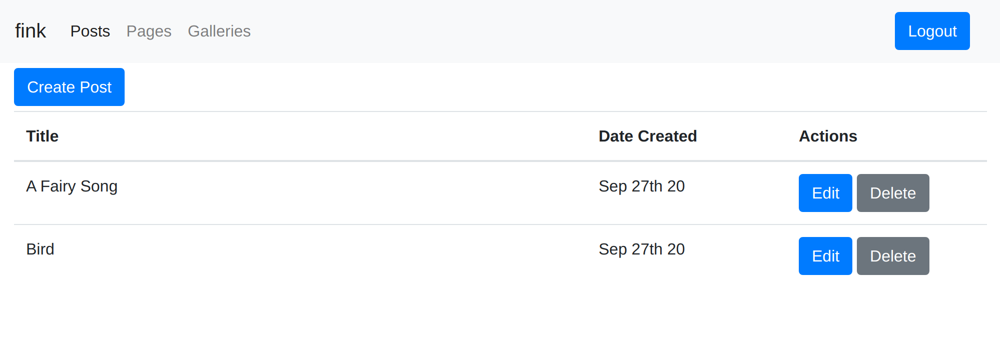

# What is it?

Fink is a light-weight web publishing solution.

At the moment the following content elements are supported:

  * Posts
  * Pages for static content
  * Galleries


## Built with

  * Web framework [http4s](https://http4s.org/)
  * Database access [Doobie](https://tpolecat.github.io/doobie/)
  * JSON data interchange format using [circe](https://circe.github.io/circe/)
  * UI library [React](https://reactjs.org/)
  * The theme for the demo is: [Foghorn](http://wptheming.com/foghorn).

## Frontend


## Backend



# Running the demo

Clone the repo

```
$ git clone git@github.com:dozed/fink-http4s.git
$ cd fink-http4s
```

Run the backend

```
$ sbt
> run
```

Run the frontend

```
$ cd frontend-site
$ npm install
$ npm run start
```

Run the editor

```
$ cd frontend-editor
$ npm install
$ npm run start
```

The frontend is running on: [http://localhost:3010/](http://localhost:3010/)

The content editor is reachable under: [http://localhost:3000/](http://localhost:3000/)

